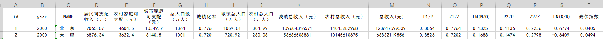

# 数据分析开发日志


## 1. 大作业选题

大作业选题有多个方面

+ 数据分析pandas筛选 pyecharts画图 打算部署到服务器建站
+ 机器学习：图形筛选、口罩检测、机器玩游戏（有代码可以抄）


结果：“567”组选择方向为数据分析。

------

​																																						2023/05/23


## 2.数据分析目标										23

1. 以“新冠疫情数据分析.ipynb”为目标

2. 在加上部署到服务器上

   - [ ] 需要域名

   - [x] 需要服务器


### 我们需要的技术

1. 因为我们有很好的数据源头，我们需要的仅仅是对垃圾数据(null值)的处理 需要技术pandas（对于要不要写入mysql可以商榷）
2. 数据可视化基本可以确认使用js接口pyecharts 需要技术(熟悉pyecharts的变量、函数、调用即可)
3. 如果要部署服务器需要通过djando结合Pyecharts来实现。可以参考[此链接](https://blog.csdn.net/qq_34156628/article/details/106308176)

-----

​																																				2023/05/24


| 时间       |       任务       |     要求     | 特殊要求                                                |
| ---------- | :--------------: | :----------: | ------------------------------------------------------- |
| 2023-05-24 | 确认主题和数据图 | 出任务规划书 | 数据集[和鲸社区](https://www.heywhale.com/home/dataset) |
|            |                  |              |                                                         |
|            |                  |              |                                                         |
|            |                  |              |                                                         |


-----

## 3.地区人员收入水平数据分析				24

1. 数据来源[和鲸社区](https://www.eol.cn/e_html/gk/fsx/index.shtml)```2000-2019年分地区人均可支配收入、城市和农村可支配收入以及泰尔指数.xlsx```



2. 对于数据用pandas进行清理
3. 明确我们需要建模的数据
   1. 中国地图下的城镇，农村人口收入图(添加年限)
   2. 历年数据对比
   3. 欢迎补充

​																																		2023/05/24

-----


​																																		2023/05/28 软考过后

----

## 4.任务分工												28

画不同的图，把代码提交即可。

数据可视化可能遇到的问题

可能出现的问题 [问题1](https://www.zhihu.com/question/265349559) [问题2](https://zhuanlan.zhihu.com/p/170561534#:~:text=pyechart,%E6%98%AF%E5%8D%95%E5%9B%BE%E8%A1%A8%E7%9A%84%E5%AE%B9%E5%99%A8%E3%80%82)


例如


需要技术

+ 对pandas有基本的了解
+ 调用pyecharts的函数实现画图
+ 了解自己要画什么图，对什么数据进行分析
